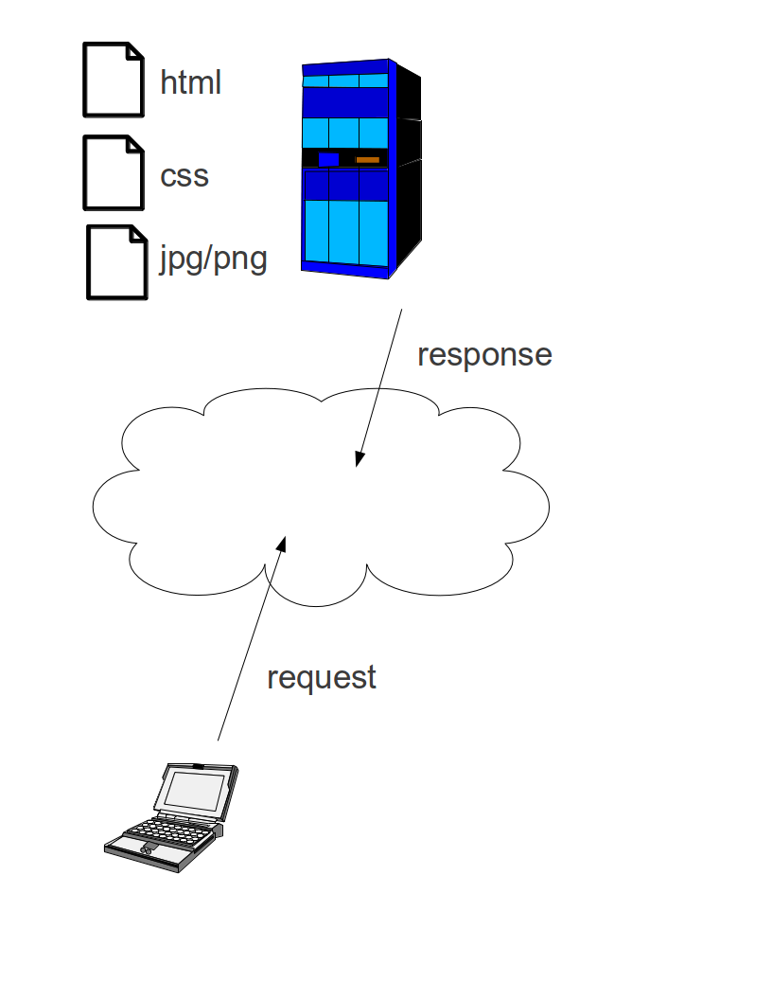
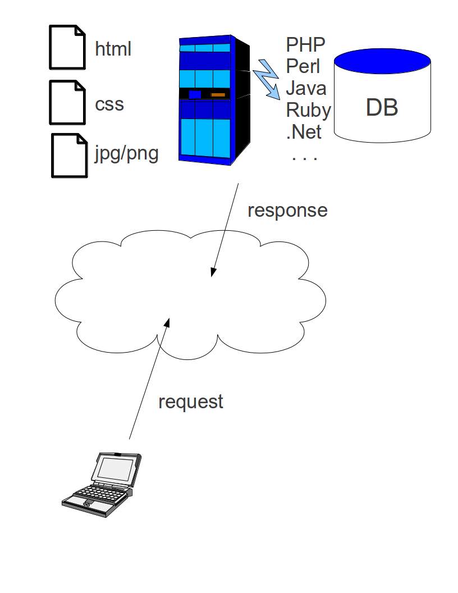
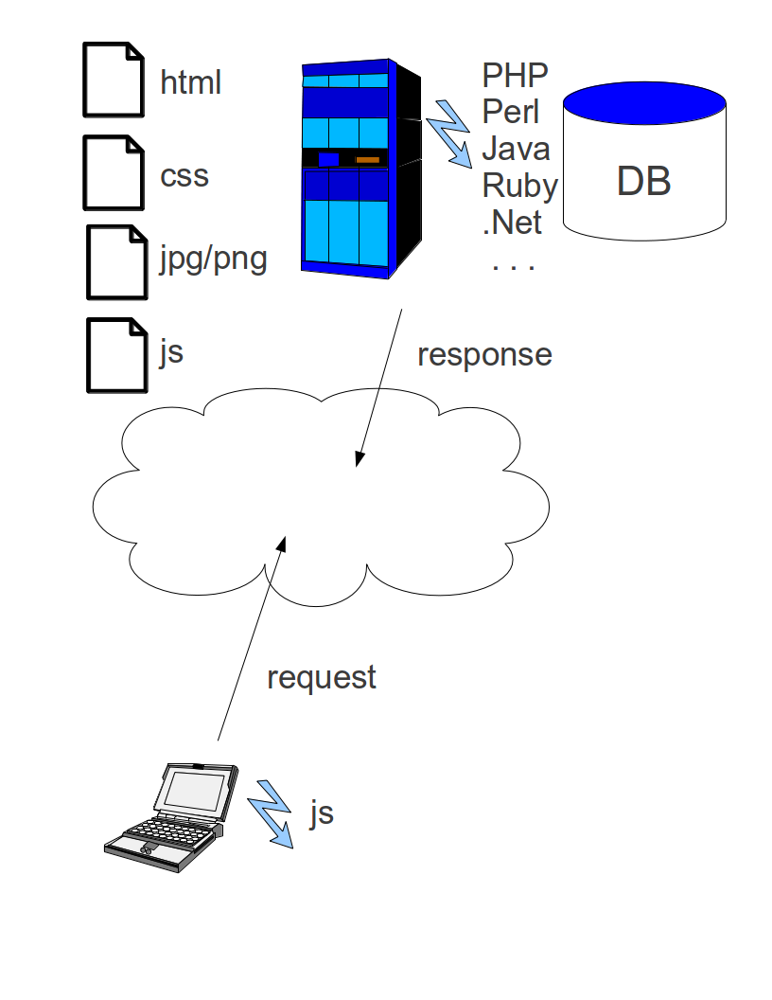
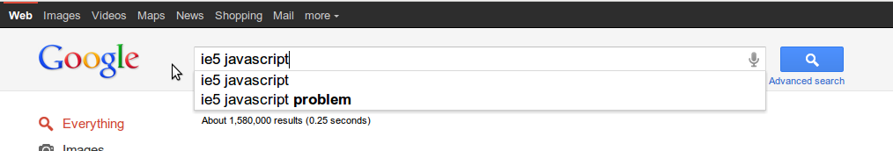
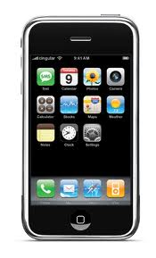
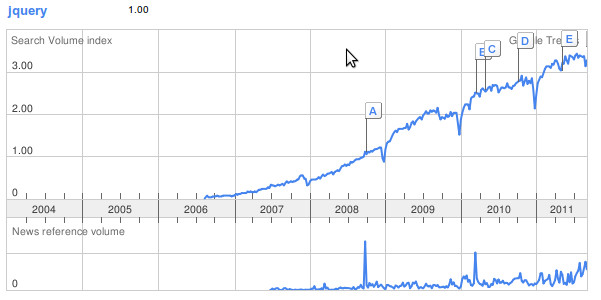

# Introduction to<br/>jQuery and Ajax

Paul A. Jungwirth

PennApps

13 September 2011

<div style="display:flex; justify-content:center; align-items:center; gap:24px; margin-top:30px">
  
  
  
</div>

Notes:

- Thank you for letting me speak. Thanks for organizing; for coming.
- Thank you to King's Court English House for hosting us.
- Who am I?
  - Paul Jungwirth
  - Programmer for 10+ years, but been in the Classics department the last four.
  - Now taking a leave of absence to work as CTO for a blossoming startup: Elect Next!
    - We help you find the candidates who best represent you, all the way down your ticket.
    - We just got in to DreamIt, a Philly-based accelerator program.
    - Eight people so far.
  - Starting to get interest from venture capitalists, so it's very exciting.
- Topic: jQuery and Ajax.
  - Disclaimer: we'll only be able to touch on the very basics. Consider this an overview that should tempt you to learn the whole story.
- Assumptions: You know HTML and CSS. It will help to know a little bit of Javascript.


# Website: No Scripting
<!-- .element: class="r-fit-text" -->



Notes:

- We want to create faster, more functional websites; we're trying to do more and more with Javascript.
- The simplest website just serves static files: the browser asks the server for pages, images, etc., and the server sends them back.


# Website: With Scripting
<!-- .element: class="r-fit-text" -->



Notes:

- Most website code runs on the server.
- Server-side scripting builds each page dynamically before sending it to the browser.


# Website: With Javascript
<!-- .element: class="r-fit-text" -->



Notes:

- But Javascript runs on the client, in the browser.
- Better user experience:
  - More responsive.
  - Non-web things like drag-and-drop.
  - Gmail, Google Maps, Google Docs: all are built with Javascript.
- Offload tasks from the server to the web browser — you're not paying for the CPU or bandwidth.


# Javascript Intro

```javascript
function euclidean_distance(x1, y1, x2, y2) {
  var tmp = Math.pow(x2 - x1, 2) + Math.pow(y2 - y1, 2);
  return Math.sqrt(tmp);
}

alert(euclidean_distance(2, 2, 4, 5));
```

Notes:

- So what does Javascript look like? A lot like C/Java!
  - You've got curly braces, semi-colons.
  - Variables look similar, except you just declare them with a "var".
  - To define a function you say "function". There's still a return statement.
  - The alert() function is built in and pops up a dialog box.
  - There's a Math namespace which provides math-related functions.


# Browser Incompatibilities

 <!-- .element style="width: 600px" -->

<div class="browsers">
  
  
  
  
  
  
</div>

Notes:

- BUT: Javascript is a pain.
- Browser incompatibilities.
  - IE is the big stinker here.
    - Most of us can't afford to just ignore it.
    - There are more and more browsers out there.
      - You can't just support IE, Firefox, and maybe Safari.
      - Now there is iPhone, iPad, Android, other tablets....


# Ajax is a Pain

```javascript
var xhr;
if (window.ActiveXObject) {
  xhr = new ActiveXObject("Microsoft.XMLHTTP");
} else if (window.XMLHttpRequest) {
  xhr = new XMLHttpRequest();
} else {
  throw new Error("Ajax is not supported by this browser.");
}

xhr.onreadystatechange = function() {
  if (this.readyState == 4) {
    if (this.status >= 200 &&
      this.status < 300) {
      // success
    } else {
      // trouble
    }
  }
}

xhr.open('GET', '/candidates/56/answer');
```

Notes:

- Ajax is trickier: asynchronous, lots of typing, callbacks.


# jQuery History



Notes:

- History: started in 2005.
- 1.4 was huge. Now we're up to 1.6.3.


# jQuery Philosophy
<!-- .element: class="r-fit-text" -->


Notes:

- jQuery has a handful of guiding principles. Let's walk through them.


# jQuery Philosophy
<!-- .element: class="r-fit-text" -->

### Hide browser differences.

### Degrade gracefully.

### Use Unobtrusive Javascript (UJS).

```html
<a href="javascript:alert('Thanks for clicking!');">click here</a>
```

### Select DOM Items with CSS Syntax.

### Everything is a Callback

Notes:

- Hide browser differences:
  - Don't call native Javascript functions (especially DOM stuff), but use jQuery calls to wrap browser-testing for you.
  - Use jQuery events, not native events.
  - If really necessary, test for functionality, not browser:
    - jQuery gives you lots of flags for this kind of thing.
    - It's kind of the autoconf method, if you've ever used that before.
- Graceful degradation:
  - People should be able to use your site even if all the JS doesn't work.
    - Even Grandma can use the site.
  - More and more people are abandoning this principle:
    - "Web applications": Gmail, Google Maps, ...
    - Others, too: Stack Overflow (kind of).
    - I'm sympathetic.
      - "Grandma" isn't the one disabling Javascript.
      - It takes a lot of work to build your site twice.
      - Javascript and Ajax really do enable better usability.
      - But if you consider mobile devices, there are a lot of crippled browsers.
      - And Grandma might be running IE 5.
      - So it's still pretty important to aim for graceful degradation.
- Unobtrusive Javascript (UJS):
  - Bad: `<a href="javascript:alert('Thanks for clicking me!');">click here</a>`
  - What if the user doesn't have Javascript? That's messy! Do you really want to read that?


# CSS Review

```css
// Select based on the element name:
p {
  margin-top: 0.8em;
}

// Select based on the element's "class" attribute:
.important {
  border: solid red 2px;
}

// Select based on the element's "id" attribute:
#header {
  font-family: Impact;
  font-size: 150%;
}

// Combine them:
ul.todo {
  background-color: #aaeeff;
}

// Nest them:
#header a {
  color: inherit;
}
```

Notes:

- jQuery selects items in the DOM using a CSS-like syntax.
- Select based on the element name, on the class attribute, on the id attribute.
- Combine them, and nest them.


# Callbacks

```cpp
typedef void (*sighandler_t)(int);
sighandler_t signal(int signum, sighandler_t handler);
```

Notes:

- Who has C experience? So what does this mean?
  - If you want to call the `signal` function, what are its two arguments?
- Callbacks are when you provide a method and ask your framework to call it under certain conditions.
  - It's a little circuitous, but it's sometimes useful.
  - Event-based programming: very important for desktop apps or mobile apps. Also the core idea of node.js. Very important to jQuery.


# Callbacks for Events
<!-- .element: class="r-fit-text" -->

```html
<script type="javascript">
  function highlight() {
    // ...
  }
</script>

<a onmouseover="javascript:highlight">Click here</a>
```

Notes:

- This is a simple event-based callback.


# Functions are Objects
<!-- .element: class="r-fit-text" -->

```javascript
setTimeout(explode, 10000);
```

or (an anonymous function):

```javascript
setTimeout(function() {
  alert("Time's up!");
}, 10000);
```

Notes:

- An important Javascript feature for using jQuery: functions are objects.
- They can be arguments to other functions.


# Functions are Objects
<!-- .element: class="r-fit-text" -->

Sub-functions:

```javascript
function fibonacci(n) {
  // Optimization of fibonacci(n-2) + fibonacci(n-1)
  var results = [1, 1];
  var _fib = function(n) {
    if (!results[n]) {
      results[n] = _fib(n-2) + _fib(n-1);
    }
    return results[n];
  }
  return _fib(n);
}
```

Notes:

- They can have their own sub-functions.
- Here is one with a helper function. Note how it can read the state of its parent function.


# Functions are Objects
<!-- .element: class="r-fit-text" -->

Functions as constructors:

```javascript
function Dog(theName) {
  this.name = theName;

  this.speak = function() {
    alert(this.name + ' says "Woof!"');
  }

  this.fetch = function() {
    // ...
  }
}

var fido = new Dog("Fido");
fido.speak();
```

Notes:

- You can use this to create "objects" where the outside function is the constructor.
- Single-threaded:
  - Ajax adds asynchronous calls on the network, but there is only one thread in Javascript. Much simpler!
- Event-based:
  - The DOM has all kinds of events, for clicking, mousing, etc.


# First Problem:
# Ready Handler

We want to run some Javascript<br/>
after the page is fully loaded.

- Necessary for UJS.
- Earliest we can access the DOM.
- This is too late:

```javascript
window.onload = function() {
  // ...
}
```

Notes:

- First problem: run some JS after the page is fully loaded.
- Necessary for UJS.
  - We want to serve the basic HTML first, then use Javascript to enhance it.
- You can't reliably access anything in the DOM before the page is loaded.
- We could use `window.onload`, but that won't run until all the pictures are loaded, too. Pictures, and YouTube videos, and ....


# First Problem:
# Ready Handler

```javascript
$(function() {
  alert("Hello world!");
});
```

Notes:

- Here is the jQuery.
- "$" is a valid identifier in Javascript. So what is it here?
  - We're calling a function named "$".
  - We're passing an anonymous function.
  - "$" is *the* jQuery function.
    - Its behavior varies based on what you pass it.
    - If you pass it a function, then it runs that function when the page is fully loaded. (This is called a ready-handler.)
    - It can do other things, too, as we'll see.
    - You can also call it `jQuery`, instead of `$`, to avoid name conflicts.
    - Or you can do this: `(function($) { /* Use "$" here.... */ })(jQuery);`


# First Problem:
# Ready Handler

another example:

```javascript
function show_login_box() {
  if (!user_is_logged_in()) {
    // ...
  }
}

$(show_login_box);
```

or

```javascript
var show_login_box = function() {
  if (!user_is_logged_in()) {
    // ...
  }
};

$(show_login_box);
```

Notes:

- Another example.
- Or — remember functions are objects. What do you do with objects? You assign them to variables!
- So that's the Ready Handler.
- Most of the code we write will go into a ready handler.


# Second Problem:
# Manipulate the DOM
<!-- .element: class="r-fit-text" -->

Make all our main images fade in:

```javascript
$('#body img').fadeIn();
```

Notes:

- Really there are two parts: picking out the elements we care about, then doing something to them.
- jQuery lets us query the DOM for the elements we want, which makes UJS easy.
  - We reach into the DOM and add Javascript wherever we like.
  - If the user doesn't have Javascript, they still get the unadorned HTML.
- jQuery's DOM selection uses a CSS-like syntax, and we get back a "matched set" object. Then we can call methods on the matched set to manipulate the elements.
- Here we ask for all the img tags in our main body of text, and make them fade in.
  - The first part is the selection; the second part is the action.
  - The selection uses that dollar sign again! But we're passing a string, not a function, so jQuery interprets it differently. This has nothing to do with ready handlers.


# Second Problem:
# Manipulate the DOM
<!-- .element: class="r-fit-text" -->

Change the html in our messages area:

```javascript
$('#messages').html(get_latest_tweets());
```

Notes:

- Or change the html in something.


# Second Problem:
# Manipulate the DOM
<!-- .element: class="r-fit-text" -->

Add a new row to a list:

```javascript
$('ul#todo').append("<li>Buy groceries</li>");
```

Notes:

- Or add a child.


# Second Problem:
# Manipulate the DOM
<!-- .element: class="r-fit-text" -->

More than just CSS:

```javascript
$('tr:last-child').addClass('table-bottom');
```

Notes:

- The selector string is very powerful. Actually it supports more than just CSS.


# Second Problem:
# Manipulate the DOM
<!-- .element: class="r-fit-text" -->

Find all the links with an absolute URL:

```javascript
$("a[href^='http://']").addClass('absolute-link');
```

Notes:

- Find all links with an absolute URL.


# Second Problem:
# Manipulate the DOM
<!-- .element: class="r-fit-text" -->

Restrict the search based on another matched set:

```javascript
var $game = $('#game');

function kill_all_monsters() {
  $('div.monster', $game).remove();
}
```

Notes:

- You can also pass another matched set as a second parameter, to restrict the search to within that set.


# Second Problem:
# Manipulate the DOM
<!-- .element: class="r-fit-text" -->

Chainable:

```javascript
function a_okay() {
  $('#status').removeClass('red').
               removeClass('yellow').
               addClass('green');
}
```

Notes:

- These methods generally return the matched set again, so they are chainable.


# Second Problem:
# Manipulate the DOM
<!-- .element: class="r-fit-text" -->

Lots of methods to use:

<div class="cols">
  <div class="col">
    html<br/>
    text<br/>
    append<br/>
    prepend<br/>
    appendTo<br/>
    prependTo<br/>
    before<br/>
    after<br/>
    insertBefore<br/>
    insertAfter<br/>
  </div>
  <div class="col">
    wrap<br/>
    wrapAll<br/>
    wrapInner<br/>
    unwrap<br/>
    remove<br/>
    detach<br/>
    empty<br/>
    clone<br/>
    replaceWith<br/>
    replaceAll<br/>
    val<br/>
  </div>
  <div class="col">
    addClass<br/>
    removeClass<br/>
    hasClass<br/>
    attr<br/>
    css<br/>
    offset<br/>
    position<br/>
    width<br/>
    height<br/>
    data<br/>
    removeData<br/>
  </div>
  <div class="col">
    show<br/>
    hide<br/>
    toggle<br/>
    fadeIn<br/>
    fadeOut<br/>
    fadeTo<br/>
    slideDown<br/>
    slideUp<br/>
  </div>
</div>

Notes:

- Some of the methods available.


# Second Problem:
# Manipulate the DOM
<!-- .element: class="r-fit-text" -->

Or use `each`:

```javascript
$(function() {
  $('pre.source-code').each(function() {
    parse_and_add_color(this);
    $(this).css('border', 'dashed #aaeeff 1px');
  });
});
```

Notes:

- If the built-in methods don't give you what you need, you can use `each`.
  - We want to add syntax highlighting to our slideshow.
- The function gets called once for each item in the matched set.
  - jQuery sets `this` to the DOM object for that iteration.
  - You can say `$(this)` to turn any DOM object into a matched set.


# Third Problem:
# Add a Listener

Lots of events to choose from:

<div class="cols">
  <div class="col">
    click<br/>
    dblclick<br/>
    blur<br/>
    change<br/>
    error<br/>
    focus<br/>
    focusin<br/>
    focusout<br/>
    keydown<br/>
    keypress<br/>
    keyup<br/>
  </div>
  <div class="col">
    load<br/>
    mousedown<br/>
    mouseenter<br/>
    mouseleave<br/>
    mouseout<br/>
    mouseover<br/>
    resize<br/>
    scroll<br/>
    select<br/>
    submit<br/>
    unload<br/>
  </div>
</div>

Notes:

- There are lots of events we can listen for.


# Third Problem:
# Add a Listener

<div class="electnext-demo">
  <div class="electnext-header"></div>
  <div class="candidate-header">Rick Perry</div>
  <div class="candidate-column">
    <div class="block"></div>
    <div class="block padded alignment">
      <h3>Alignment</h3>
      <div class="overall"><span class="score">80</span><span class="percent-sign">%</span></div>
      <div class="other-questions">5 other questions<br/>answered</div>
    </div>
    <div class="block padded">
      <h3>Seeking<br/>the office of:</h3>
      <div class="office-sought round">President<br/>of the<br/>United States</div>
      <div class="election-day">Election on:<br/>September 6, 2012</div>
    </div>
  </div>
  <div class="candidate-main">
    <div class="question-text">Capital punishment should be abolished.</div>
    <div class="answer-buttons">
      <a href="#" class="answer-link"><div class="answer-button strongly-disagree">Strongly<br/>Disagree</div></a>
      <a href="#" class="answer-link"><div class="answer-button disagree">Disagree</div></a>
      <a href="#" class="answer-link"><div class="answer-button neutral">Neutral</div></a>
      <a href="#" class="answer-link"><div class="answer-button agree">Agree</div></a>
      <a href="#" class="answer-link"><div class="answer-button strongly-agree">Strongly<br/>Agree</div></a>
    </div>
    <div class="clear"></div>
  </div>
  <div class="clear"></div>
</div>

Notes:

- I'll give you an example from Elect Next:
  - Users create a political profile by answering questions.
  - We want to record those answers without a full page refresh.
  - But we want to use UJS. So we listen for jQuery's click event on the places we care about.


# Third Problem:
# Add a Listener

```html
<a href="/questions/56/answer?score=sd" class="answer-link">
  <div class="answer-button">Strongly<br/>Disagree</div>
</a>
<a href="/questions/56/answer?score=d" class="answer-link">
  <div class="answer-button">Disagree</div>
</a>
<a href="/questions/56/answer?score=n" class="answer-link">
  <div class="answer-button">Neutral</div>
</a>
<a href="/questions/56/answer?score=a" class="answer-link">
  <div class="answer-button">Agree</div>
</a>
<a href="/questions/56/answer?score=sa" class="answer-link">
  <div class="answer-button">Strongly<br/>Agree</div>
</a>
```

```javascript
$(function() {
  $('a.answer-link').click(function(event) {
    event.preventDefault();
    $('a.answer-link', $(this).parent()).removeClass('selected');
    $(this).addClass('selected');
    return false;
  });
});
```

Notes:

- We listen for jQuery's click event on the answer links.
- Use `event.preventDefault()` to cancel the "default semantic action", like following a link or submitting a form.
- Return false to prevent the event from propagating further.


# Fourth Problem:
# Call a Remote Server
<!-- .element: class="r-fit-text" -->

`$.get`

`$.post`

`$.ajax`

Notes:

- We're not saving the answer yet.
- Also, we'd like to update the overall match score when the user answers.
- jQuery gives us several functions to make Ajax calls: `$.get`, `$.post`, `$.ajax`.
  - These are like global functions, not methods. (Really they're functions nested inside the jQuery function, like `_fib` or `speak`.)


# Fourth Problem:
# Call a Remote Server
<!-- .element: class="r-fit-text" -->

```javascript
$.ajax({
  url: '/questions/56/answer',
  type: 'POST',
  data: 'score=sd',
  dataType: 'json',
  success: function(data, status, xhr) {
    // update the DOM here
  },
  error: function(xhr, status, exception) {
    // something went wrong
  }
});
```

Notes:

- The most general function is `$.ajax`. It takes a big options hash.


# Fourth Problem:
# Call a Remote Server
<!-- .element: class="r-fit-text" -->

or

```javascript
$.post('/questions/56/answer', 'score=sd',
  function(data, status, xhr) {
    if (status == 'success') {
      // update the DOM here
    } else {
      // something went wrong
    }
  },
  'json');
```

Notes:

- `$.get` and `$.post` are convenient abbreviations.
- There is also `$.getJSON`, so you don't have to add 'json' at the end.
- If you want to use json all the time, you can say `$.ajaxSetup({dataType: 'json'});` somewhere near the top of your Javascript.
- Finally, there's `load`, which is not a global but is called on a matched set. It expects html and replaces the contents of the matched elements with whatever html it gets back from the server.


# Fourth Problem:
# Call a Remote Server
<!-- .element: class="r-fit-text" -->

before:

```javascript
$('a.answer-link').click(function(event) {
  $.ajax({
    url: '/questions/56/answer',
    data: 'score=sd',
    // ...
  });
});
```

after:

```javascript
$('a.answer-link').click(function(event) {
  $.ajax({
    url: $(this).attr('href'),
    // ...
  });
});
```

Notes:

- But we don't really want to hard-code all those strings, so it'd be more realistic to pull the URL from the link itself with `$(this).attr('href')`.


# Fourth Problem:
# Call a Remote Server
<!-- .element: class="r-fit-text" -->

```javascript
$(function() {
  $('a.answer-link').click(function(event) {
    event.preventDefault();
    $('a.answer-link', $(this).parent()).removeClass('selected');
    $(this).addClass('selected');
    $.ajax({
      url: $(this).attr('href'),
      type: 'POST',
      dataType: 'json',
      success: function(data, status, xhr) {
        if (data.success) {
          $('#overall-match-score').html(data.success.score);
        } else {
          $('ul#notices').html(show_errors(data.errors));
        }
      },
      error: function(xhr, status, exception) {
        var msg = exception ? exception.message : ''
        $('ul#notices').html(show_errors(
          [status + ": " + msg]
        ));
      }
    });
    return false;
  });
});
```

Notes:

- Here is a (nearly) complete example.


# Demo

<div class="electnext-demo">
  <div class="electnext-header"></div>
  <div class="candidate-header">Rick Perry</div>
  <div class="candidate-column">
    <div class="block"></div>
    <div class="block padded alignment">
      <h3>Alignment</h3>
      <div class="overall"><span class="score">80</span><span class="percent-sign">%</span></div>
      <div class="other-questions">5 other questions<br/>answered</div>
    </div>
    <div class="block padded">
      <h3>Seeking<br/>the office of:</h3>
      <div class="office-sought round">President<br/>of the<br/>United States</div>
      <div class="election-day">Election on:<br/>September 6, 2012</div>
    </div>
  </div>
  <div class="candidate-main">
    <div class="question-text">Capital punishment should be abolished.</div>
    <div class="answer-buttons">
      <a href="#" class="answer-link"><div class="answer-button strongly-disagree">Strongly<br/>Disagree</div></a>
      <a href="#" class="answer-link"><div class="answer-button disagree">Disagree</div></a>
      <a href="#" class="answer-link"><div class="answer-button neutral">Neutral</div></a>
      <a href="#" class="answer-link"><div class="answer-button agree">Agree</div></a>
      <a href="#" class="answer-link"><div class="answer-button strongly-agree">Strongly<br/>Agree</div></a>
    </div>
    <div class="clear"></div>
  </div>
  <div class="clear"></div>
</div>

Notes:

- And here it is live: click an answer and watch the match score update without a full page refresh.
- Thanks for listening!
